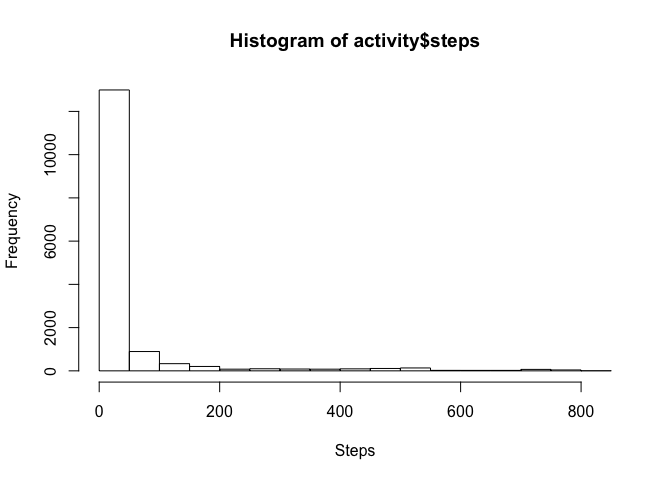
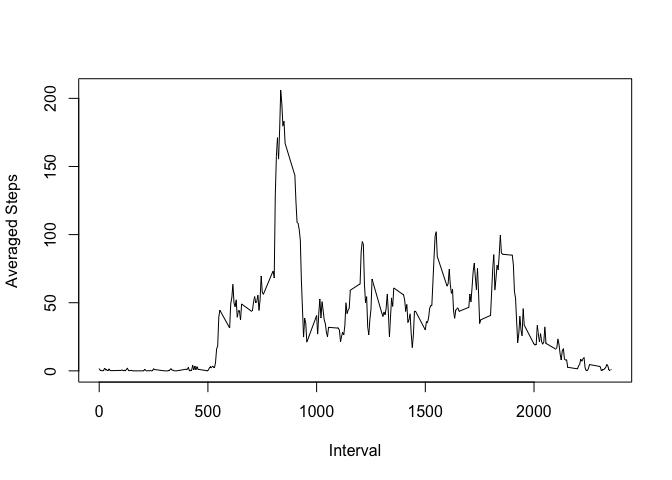
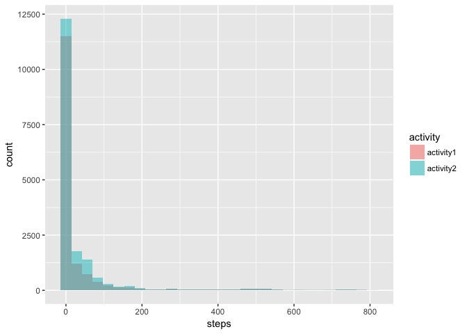
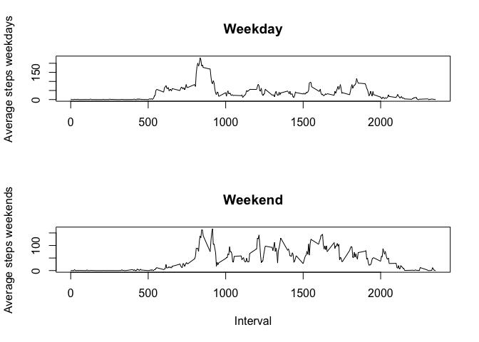

Loading and preprocessing the data
----------------------------------

Loading data from
<https://d396qusza40orc.cloudfront.net/repdata%2Fdata%2Factivity.zip>

    setwd("~/Rfolder/Data/Reproducible Research Wk 2 Assignement")

    if (!file.exists("activity.csv")) {
      download.file("https://d396qusza40orc.cloudfront.net/repdata%2Fdata%2Factivity.zip",destfile = "repdata%2Fdata%2Factivity.zip")
      unzip("repdata%2Fdata%2Factivity.zip")
    }

    activity <- read.csv("activity.csv",sep=",",header=TRUE,na.strings = "NA")
    str(activity)

    ## 'data.frame':    17568 obs. of  3 variables:
    ##  $ steps   : int  NA NA NA NA NA NA NA NA NA NA ...
    ##  $ date    : Factor w/ 61 levels "2012-10-01","2012-10-02",..: 1 1 1 1 1 1 1 1 1 1 ...
    ##  $ interval: int  0 5 10 15 20 25 30 35 40 45 ...

Converting "Date" as date format :

    activity$date <- as.Date(activity$date)
    str(activity)

    ## 'data.frame':    17568 obs. of  3 variables:
    ##  $ steps   : int  NA NA NA NA NA NA NA NA NA NA ...
    ##  $ date    : Date, format: "2012-10-01" "2012-10-01" ...
    ##  $ interval: int  0 5 10 15 20 25 30 35 40 45 ...

What is mean total number of steps taken per day?
-------------------------------------------------

1.  Calculate the total number of steps taken per day

<!-- -->

    sum(activity$steps,na.rm = TRUE)

    ## [1] 570608

1.  Histogram of the total number of steps per day :

<!-- -->

    hist(activity$steps,xlab = "Steps")

Mean of steps taken per day :

    mean(activity$steps,na.rm=TRUE)

    ## [1] 37.3826

And median :

    median(activity$steps,na.rm=TRUE)

    ## [1] 0

What is the average daily activity pattern?
-------------------------------------------

1.  Time series plot (i.e. 𝚝𝚢𝚙𝚎 = "𝚕") of the 5-minute interval (x-axis)
    and the average number of steps taken, averaged across all
    days (y-axis)

<!-- -->

    #First get the average number of steps per 5 minutes interval across all days with tapply and store it in meanStepsInterval
    meanStepsInterval <- tapply(activity$steps,activity$interval,mean,na.rm=TRUE)
    #Plotting average number of steps per day by 5-minute interval
    plot(unique(activity$interval),meanStepsInterval,type='l',xlab = "Interval",ylab='Averaged Steps')

1.  5-minute interval, on average across all the days in the dataset
    that contains the maximum number of steps :

<!-- -->

    meanStepsInterval[meanStepsInterval==max(meanStepsInterval)]

    ##      835 
    ## 206.1698

Imputing missing values
-----------------------

1.  Counting NAs :

<!-- -->

    # summary function gives us the number of missing value per columns
    summary(activity)

    ##      steps             date               interval     
    ##  Min.   :  0.00   Min.   :2012-10-01   Min.   :   0.0  
    ##  1st Qu.:  0.00   1st Qu.:2012-10-16   1st Qu.: 588.8  
    ##  Median :  0.00   Median :2012-10-31   Median :1177.5  
    ##  Mean   : 37.38   Mean   :2012-10-31   Mean   :1177.5  
    ##  3rd Qu.: 12.00   3rd Qu.:2012-11-15   3rd Qu.:1766.2  
    ##  Max.   :806.00   Max.   :2012-11-30   Max.   :2355.0  
    ##  NA's   :2304

As we can wee, we have 2304 NAs in the "Steps" recorded.

1.  and 3. Strategy for filling NAs : I chose to replace NA by the
    average steps for the corresponding interval :

<!-- -->

    activity2 <- activity
    for (i in seq(length(activity2$steps))){ 
      if (is.na(activity2$steps[i])) {
              num <- as.character(activity2$interval[i])
              activity2$steps[i] <- meanStepsInterval[num]
      }
    }
    summary(activity2)

    ##      steps             date               interval     
    ##  Min.   :  0.00   Min.   :2012-10-01   Min.   :   0.0  
    ##  1st Qu.:  0.00   1st Qu.:2012-10-16   1st Qu.: 588.8  
    ##  Median :  0.00   Median :2012-10-31   Median :1177.5  
    ##  Mean   : 37.38   Mean   :2012-10-31   Mean   :1177.5  
    ##  3rd Qu.: 27.00   3rd Qu.:2012-11-15   3rd Qu.:1766.2  
    ##  Max.   :806.00   Max.   :2012-11-30   Max.   :2355.0

We can see that we don't have NAs anymore and that 3rd Quantile has
increased. 4. Let's check it graphically :

    library(ggplot2)
    # We need to merge both DF into one to make an histogram
    activity$activity <- "activity1"
    activity2$activity <- "activity2"
    activities <- rbind(activity,activity2)
    activities$activity <- as.factor(activities$activity)

    ggplot(activities, aes(steps, fill = activity)) + geom_histogram(alpha = 0.5, position = 'identity')

    ## `stat_bin()` using `bins = 30`. Pick better value with `binwidth`.

    ## Warning: Removed 2304 rows containing non-finite values (stat_bin).

As we can see, replacing NAs by the average steps has increased steps
values significantly.

Are there differences in activity patterns between weekdays and weekends?
-------------------------------------------------------------------------

1.  Creating a new variable "day" that precise "weekday" and "weekend".
    We use activities with replaced NAs:

<!-- -->

    for (j in seq(length(activity$steps))) {
            
            if (weekdays(activity2$date[j])=="Samedi" | weekdays(activity2$date[j])=="Dimanche") {
                    activity2$day[j] <- "weekend"
            } 
            else {
                    activity2$day[j] <- "weekday"
                    }
    }
    #Checking how weekdays and weekends we get :
    table(activity2$day)

    ## 
    ## weekday weekend 
    ##   12960    4608

1.  Plot of the 5-minutes interval and the average number of steps by
    weekdays and weekends :

<!-- -->

    weekDays <- subset(activity2,activity2$day=="weekday")
    weekEnds <- subset(activity2,activity2$day=="weekend")
    weekDaysMean <- tapply(weekDays$steps,weekDays$interval,mean)
    weekEndsMean <- tapply(weekEnds$steps,weekEnds$interval,mean)

    par(mfrow=c(2,1))
    plot(unique(activity2$interval),weekDaysMean,type = "l",ylab = "Average steps weekdays",xlab="",main = "Weekday")
    plot(unique(activity2$interval),weekEndsMean,type="l",ylab = "Average steps weekends",xlab="Interval",main="Weekend")

As we can see, there are more steps taken on average during weekends
rather than during weekdays.
